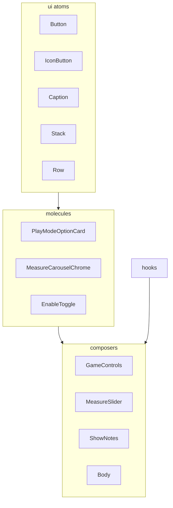
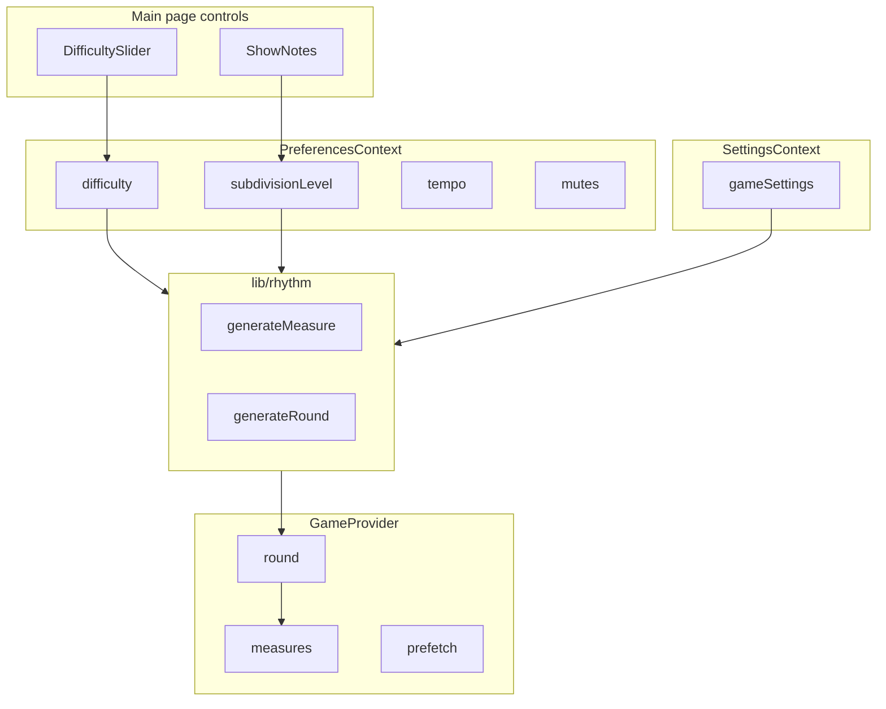
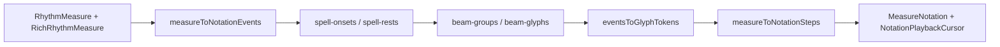

# Architecture

Overview of Poison Rhythm’s engine, state, settings, and UI composition. See [README.md](../README.md) for getting started. Cursor conventions: [`.cursor/components.mdc`](../.cursor/components.mdc), [`.cursor/react.mdc`](../.cursor/react.mdc).

## UI composition

Feature UI is stacked like layers: **atoms → molecules → composers**, with side effects in hooks.

| Layer | Path | Examples |
|-------|------|----------|
| Atoms | `src/components/ui/` | `Button`, `IconButton`, `Caption`, `Stack`, `Row` |
| Molecules | domain folders | `PlayModeOptionCard`, `ModalActions`, `MeasureCarouselChrome`, settings `EnableToggle` |
| Composers | domain folders | `GameControls`, `MeasureSlider`, `ShowNotes`, `PoisonSection`, `Body` |
| Hooks | `src/hooks/` | `usePendingDifficulty`, `useMeasurePlaybackSync`, `useHoverPinPopover`, `useSoftDisableFocus`, `useMusiSyncFont`, `useSmoothNotationCursor`, `useGameLoop` |

Rules of thumb:

- Prefer **one root HTML element** per component (or a documented layout role such as `Stack` / `Row`)
- Composers wire context and hooks; atoms/molecules take **explicit props**
- Do not add raw `<button className=…>` in composers — use `@/components/ui` or settings atoms
- **Variants over `className`** on shared components

Main page shell: `Header` → `Body` (`GameControls`, `PoisonSection`, `MeasuresSection`, `PlayControls`) → `Footer`.

| Composer | Notable layers / hooks |
|----------|------------------------|
| `GameControls` | `PlayModesModal`, `DifficultyHelpModal`, `ConfirmRegenModal`, `usePendingDifficulty` |
| `MeasureSlider` | `MeasureCarouselChrome`, `NextMeasurePreview`, `useMeasurePlaybackSync` |
| `ShowNotes` | `ShowNotesTrigger`, `ShowNotesSlider`, `useHoverPinPopover` |
| `PoisonSection` | `PoisonMeasureContent`, `PoisonMeasureFrame`, `DisplayModeModal` / `DisplayModeControls` |
| `Body` | `useSoftDisableFocus` |

Settings tab panels (`Mode`, `Sound`, `Appearance`) remain composition-only over `layout/settings/` atoms (`SettingsGroup`, `EnableToggle`, `When`, …). Play mode picking lives on the main page (mode badge → `PlayModesModal`). Display mode (grid / notation; scroll Coming Soon) lives on the Poison Rhythm section badge → `DisplayModeModal`.

## State flow

## Complexity model

| Input | Source | Generation effect |
|-------|--------|-------------------|
| Difficulty 1–5 | Main page slider | Hit count range; placement bias (downbeats → full 16th grid) |
| Subdivision 1/4–1/16 | Header ShowNotes | Allowed grid positions; display and playback grid |
| Accents / phrase | Settings → Rhythm (Coming Soon) | Optional accent marks, multi-bar phrases |
| Sticking | Settings → Rhythm (Coming Soon) | L/R assignment on hits |

Density, syncopation, and subdivision are **not** separate Settings fields.

## Game settings schema

Defined in `src/lib/settings-schema.ts`, persisted as `poison-rhythm-settings-v1`.

| Category | Fields |
|----------|--------|
| General | `players`, `feedbackMode`; `scrollDirection` / `scrollSpeed` (Coming Soon in Display Mode) |
| Practice | `showNextMeasure`, `demoBeforePlay`, `muteOnStudentPass` |
| Rhythm | `accents`, `sticking`, `phraseLength` (Coming Soon in Settings); `rests` (unused; always off) |
| Poison | `poisonMode` (Eye toggle on Poison section) |
| Game mode | `gameMode` |
| Endless | `endless` toggle (Play Modes); batch sizes (`endlessInitialBatch`, `endlessAppendBatch`, `endlessPrefetchRemaining`) use schema defaults — not exposed in the Settings modal |

## Playback passes

When `demoBeforePlay` is enabled:

1. Count-in (optional; Sound → Count-In Before Play)
2. For **each** carousel measure: **Listening (demo) pass** — plays the current measure so students can hear it; cells highlighted
3. **Playing (student) pass** — same measure again; if `muteOnStudentPass`, rhythm hits suppressed; metronome continues
4. Advance to the next measure and repeat from step 2

Implemented in `MetronomeProvider` with `playbackPass`: `'demo' | 'student'` and `setPlaybackMeasure` (current carousel cell).

Count-in and playback share one continuous **audio-clock** timeline (see [Audio engine](#audio-engine)). After each playback bar, look-ahead pauses until React can sync the next measure (`requestAnimationFrame` × 2). Count-in does **not** pause before the first playback step — that join stays sample-accurate on the audio clock.

## Game modes

| `gameMode` | Module behavior |
|------------|-----------------|
| `default` | Probabilistic poison insertion; stop at poison measure (unless `endless`) |
| `bucketTrainer` | Bucket Drumming: poison off; endless on; sticking locked by difficulty |

Hide-during-playback is controlled by Poison Rhythm visibility (`poisonMode: hidden` via the Eye toggle), not a separate `gameMode`.

`endless: true` (Play Modes checkbox) uses a fixed initial batch and appends when `remaining <= endlessPrefetchRemaining` (schema defaults; not editable in the Settings modal). Bucket Drumming always forces endless.

## Rhythm engine modules

| Module | Role |
|--------|------|
| `grid.ts` | `allowedIndicesForSubdivisionLevel` |
| `density.ts` | `computeHitCount(difficulty, rng)` |
| `syncopation.ts` | `pickHitIndices` — difficulty-based placement |
| `accents-rests.ts` | Accent and rest gap injection |
| `sticking.ts` | L/R patterns |
| `poison.ts` | Poison probability and visibility helpers |
| `phrase.ts` | Multi-bar phrase assembly |
| `prng.ts` | Seeded mulberry32 PRNG |
| `generate-measure.ts` | Orchestrator |
| `generate-round.ts` | Round and batch generation |

## Notation pipeline

When `rhythmRenderMode` is `notation`, measures render as MusiSync font glyphs instead of the 16-cell grid.

| Module | Role |
|--------|------|
| `notation-events.ts` | Boolean grid → timed note/rest events |
| `spell-onsets.ts` / `spell-rests.ts` | Contemporary duration spelling per subdivision level |
| `duration-units.ts` | Cell ↔ duration mapping |
| `beam-groups.ts` / `beam-notes.ts` / `beam-glyphs.ts` | Beamed eighth/sixteenth groups |
| `events-to-musisync.ts` | Events → MusiSync glyph string |
| `measure-to-notation.ts` | Flat `NotationStep[]` for overlays and playback cursor |
| `load-musisync-font.ts` | `@font-face` preload; `useMusiSyncFont` in UI |

Font assets: canonical copies in `src/assets/fonts/`; served from `public/fonts/` as static `/fonts/MusiSync.*` URLs. See [`src/assets/fonts/README.md`](../src/assets/fonts/README.md) for glyph keys and refresh steps.

Playback cursor: `useSmoothNotationCursor` interpolates position across `NotationStep` indices; `NotationPlaybackCursor` highlights the active glyph during demo/student passes.

## Audio engine

| Module | Role |
|--------|------|
| `audio/audio-engine.ts` | `createAudioEngine` — metronome clicks and rhythm hits via Web Audio |
| `playback-clock.ts` | Pure event timeline: optional count-in, then subdivision steps |
| `lookahead-scheduler.ts` | Polls `AudioContext.currentTime`; schedules within `SCHEDULE_AHEAD_SEC` |
| `count-in-schedule.ts` | `planCountIn` helper over the playback clock |
| `measure-playback.ts` | Measure-level step indexing for carousel sync |
| `playback-state.ts` | Count-in / demo / student pass gating for cell highlight |
| `scroll-animation.ts` | Scroll-mode animation helpers (Coming Soon in Display Mode) |
| `MetronomeProvider` | Schedules clicks/hits on the audio clock; UI updates via delayed timeouts |

## Types

| Type | Description |
|------|-------------|
| `RhythmMeasure` | Legacy `boolean[]` (16 cells) |
| `RichRhythmMeasure` | `RhythmStep[]` with accent/sticking metadata |
| `Round` | Generated round with seed and poison index |
| `GameState` | Round + index + active game mode |

Adapters: `legacyToRichMeasure`, `richToLegacyMeasure` in `src/types/rhythm.ts`.

## Tests

Unit and integration under `src/lib/__tests__/`:

- `playback-clock.test.ts` / `lookahead-scheduler.test.ts` — continuous count-in → playback timeline
- `playback-state.test.ts` — count-in / preview pass gating for cell highlight; `nextPassAfterBar`
- `integration/playback-flow.test.ts` — count-in → preview/student → advance + audio-clock join
- `count-in-schedule.test.ts` — `planCountIn` matches the playback clock
- `settings-schema.test.ts`
- `prng.test.ts`
- `rhythm/` — density, syncopation (placement), poison, sticking
- `notation/` — duration spelling, beaming, MusiSync glyph mapping, ABC export
- `game-modes/` — endless, demo-playback
- `audio-engine.test.ts` — click/hit scheduling
- Plus existing preference, difficulty, subdivision, tempo, theme suites

Playwright under `e2e/` (production preview via `vite preview`):

- `playback.spec.ts` — generate round, count-in highlight gating, demo pass
- `a11y.spec.ts` — axe (empty, round, settings/Sound, metronome, modals, count-in)
- `notation-scroll.spec.ts` — MusiSync overflow
- `helpers.ts` — shared localStorage seeding

| Command | Suite |
|---------|--------|
| `bun run lint` / `bun run ci` | Biome lint / ci |
| `bun run test` | Bun unit + integration |
| `bun run test:integration` | Integration only |
| `bun run test:e2e` | Playwright |
| `bun run test:a11y` | axe a11y only |
| `bun run test:all` | Biome ci + Bun + Playwright |
